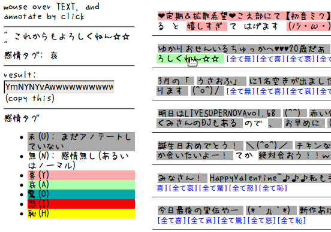

# ガイドライン

- ファイル概要
- 感情タグ
- 付与する感情タグの選び方
- 付与の操作

# ファイル概要

ファイルには複数のツイートが、
顔文字、接続詞と接続助詞、その他のテキスト、の単位で分割された状態で
記述されている。  
この内の「その他のテキスト」および「顔文字」に対して、
あなたが適切だと思う感情タグの付与をあなたにお願いします。

# 感情タグ

感情タグは次の6つ

- null
- yor
- ai
- odo
- ika
- haj

感情タグには次のように意味を与えることにする。

### null
感情なし、ノーマルの状態

### yor
喜んでる状態。笑っている状態

### ai
悲哀の状態

### odo
驚きの状態

### ika
怒っている状態

### haj
恥じらっている、照れている状態


# 付与する感情タグの選び方

一つのテキストの全体を見た後、
「その他のテキスト」と「顔文字」のそれぞれに対して、
次のように感情タグを <b>ちょうど1つ</b> を判断して付与する。

## その他のテキスト
「そのテキストを実際に書き手が読み上げる際に、
そのテキストのその箇所は先に挙げたどの感情を込めて
読むか」

## 顔文字
「その顔文字はその文脈でどの感情として働いているか」

例えば、明らかに泣いている表情を表す顔文字でも、
テキスト全体から、その顔文字は喜びとして働いていると判断した場合、`yor`を付与する。

### 例
> 最後まで付き合ってくれてありがとう(;_;)

`(;_;)`は一般に泣いている表情を表すが、
直前の「ありがとう」から嬉しくて泣いていると判断するならば、
`yor`が適切であると判断してもよい。

# 付与の操作

HTMLで書かれた簡単なインターフェイスを用意したが、
動かないか操作がわかりづらいなどあれば、
直接テキストを編集しても構わない。

## インターフェイスの説明



付与すべき対象のテキスト(或いは顔文字)にマウスオーバーすると、
左にそのテキストと、今そのテキストに振られている感情タグが出力される。
複数回クリックすることで、感情タグを付与する。
また、テキストの背景色は今振られている感情タグに対応する。

初め、テキストに感情タグが振られていない状態の背景色は灰色で、
これが残っているテキストは、実験には用いないことにする。
アノテート作業を途中で放棄する場合には、
その状態を残したまま、次の「結果報告」に進む。

また、見逃したために、感情タグを振ることを忘れることを防止するため、
または作業の簡易化のためとして、
テキストの最後に

- [全て無]
- [全て喜]

があり、これをクリックすると、そのツイートの中のテキストを全て、
感情なし、喜び、で上書きする。

### 結果報告

アノテート作業を終了する時、
左に出力される、`result` の文字列をコピーして、
これを何らかの手段で私に送ってください。

## 直接ファイルを編集する場合

<text>~</text>, <icon>~</icon> に挟まれるテキスト(行単位になっている)を
null, yor, ai, odo, ika, haj
のいずれかで置き換える

### 例

元ファイル

```
<text>
神宮寺さんが誕生日だそうですね
</text>
<icon>
=＾･ω･＾= |
</icon>
<text>
高良バ「
</text>
<text>
レン」
</text>
<text>
タインデー…
</text>
<icon>
(・ω・)
</icon>
__EOT__
```

アノテート作業後

```
<text>
yor
</text>
<icon>
yor
</icon>
<text>
null
</text>
<text>
null
</text>
<text>
null
</text>
<icon>
null
</icon>
__EOT__
```

作業を途中で中断する場合などは、
そのままにして、次の「結果報告」に進む。

### 結果報告

編集した後のファイルを何らかの手段で私に送ってください。


